# Python and Windows API 
This is a repository of Python scripts that interacts with the Windows API. 

------

### **Script** 01_HelloWorld.py 

**Description:**  A traditional HelloWorld script that explores the concept of Windows DLL, handles and the necessary parameters to call the Windows API call MessageBoxW().

**The Code:**

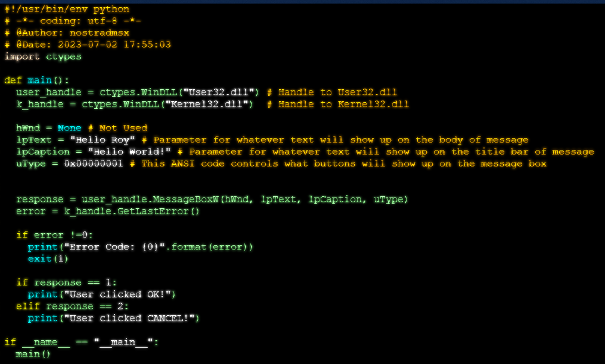

**Windows API Documentation Link**: https://learn.microsoft.com/en-us/windows/win32/api/winuser/nf-winuser-messageboxw

**Windows API Documentation Excerpt:**

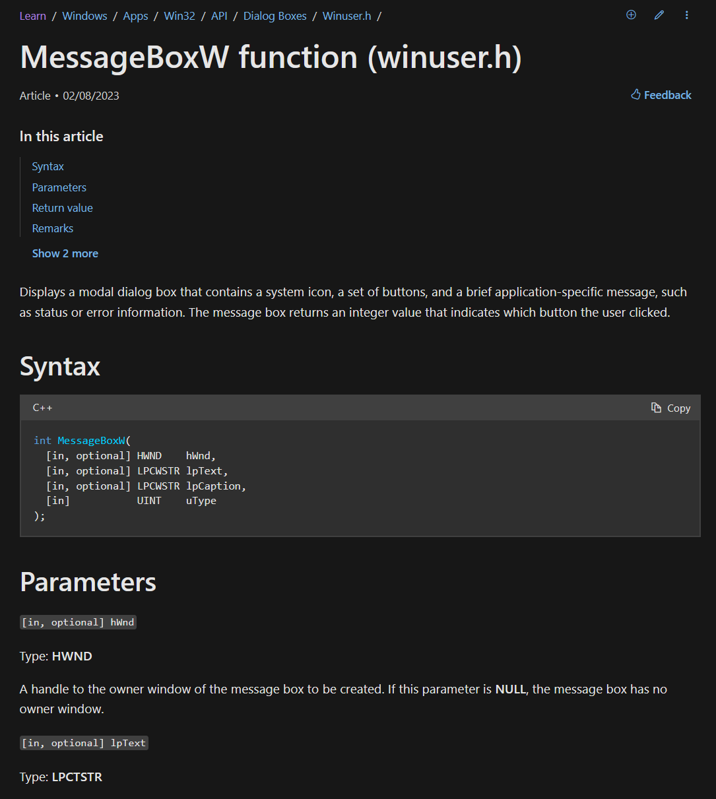

**Results:**

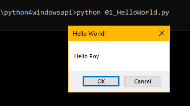

------

## **Script:** 03_ProcessKiller.py

**Description:** A script that uses the Windows API calls or systems calls via Python Script that in order to kill any Windows Process

**The Code:**

*Initialization and User Input:*

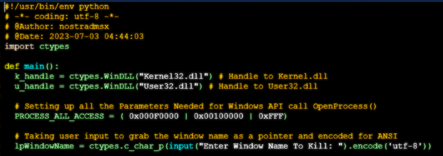

***FindWindowA*** *(code and documentation)*

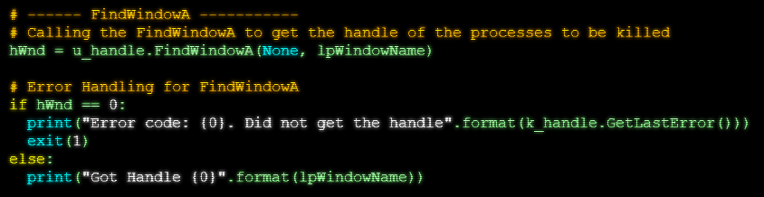

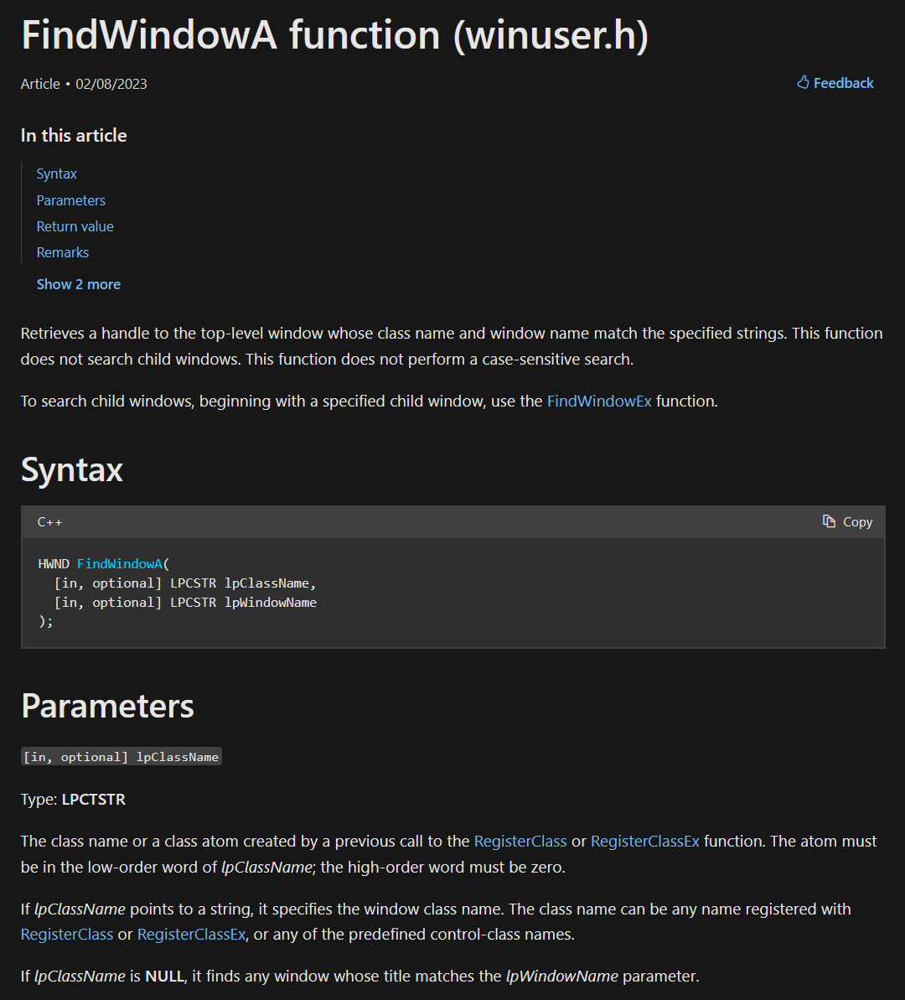

**Windows API Documentation Link**: https://learn.microsoft.com/en-us/windows/win32/api/winuser/nf-winuser-findwindowa

***GetWindowThreadProcessId*** *(Code and Documentation)*

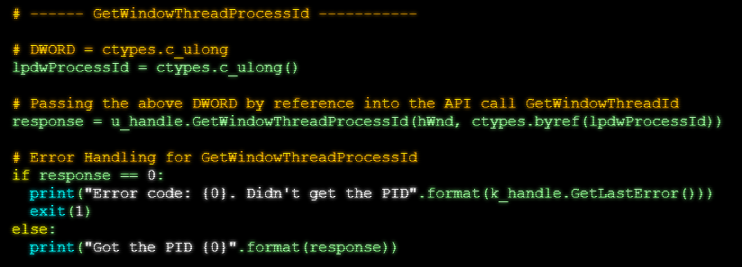

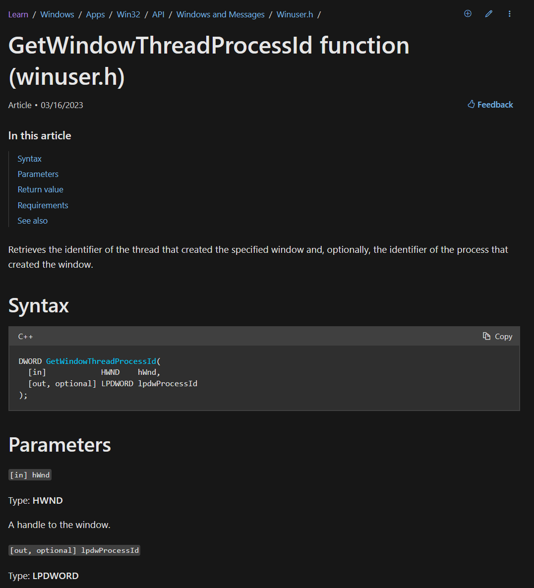

**Windows API Documentation Link**: https://learn.microsoft.com/en-us/windows/win32/api/winuser/nf-winuser-getwindowthreadprocessid

***OpenProcess*** *(code and documentation)*

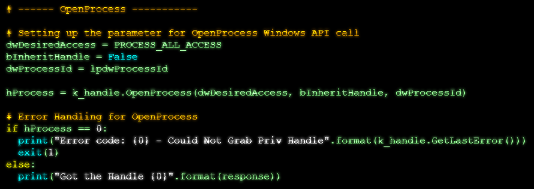

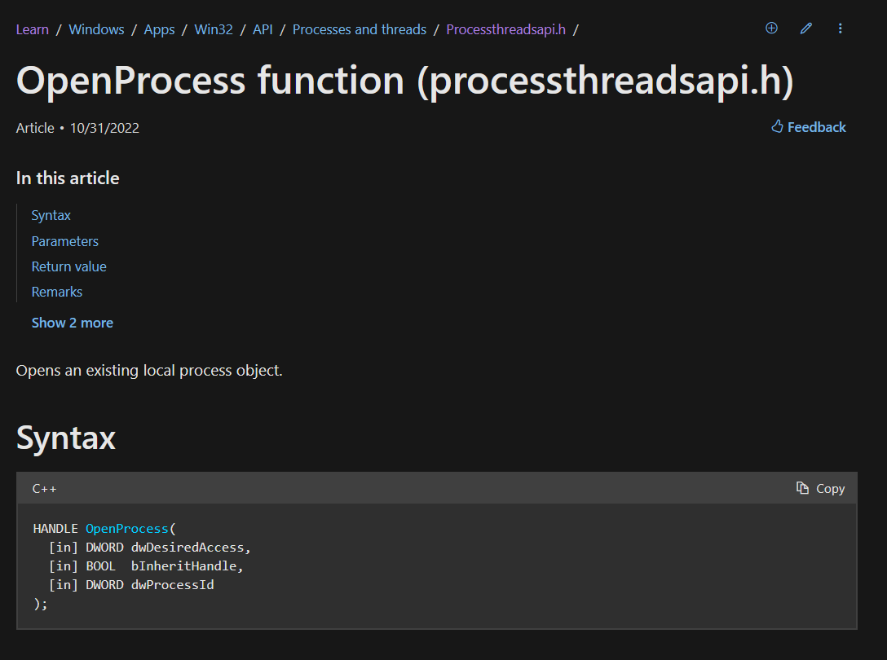

**Windows API Documentation Link**: https://learn.microsoft.com/en-us/windows/win32/api/processthreadsapi/nf-processthreadsapi-openprocess

***TerminateProcess*** *(Code and Documentation)*

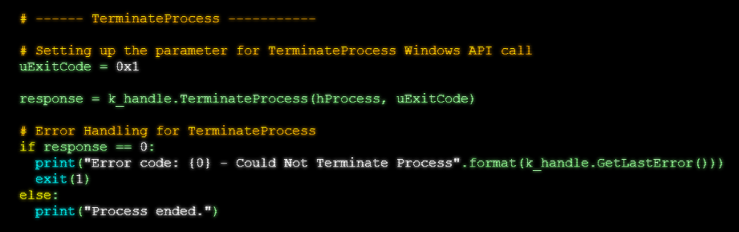

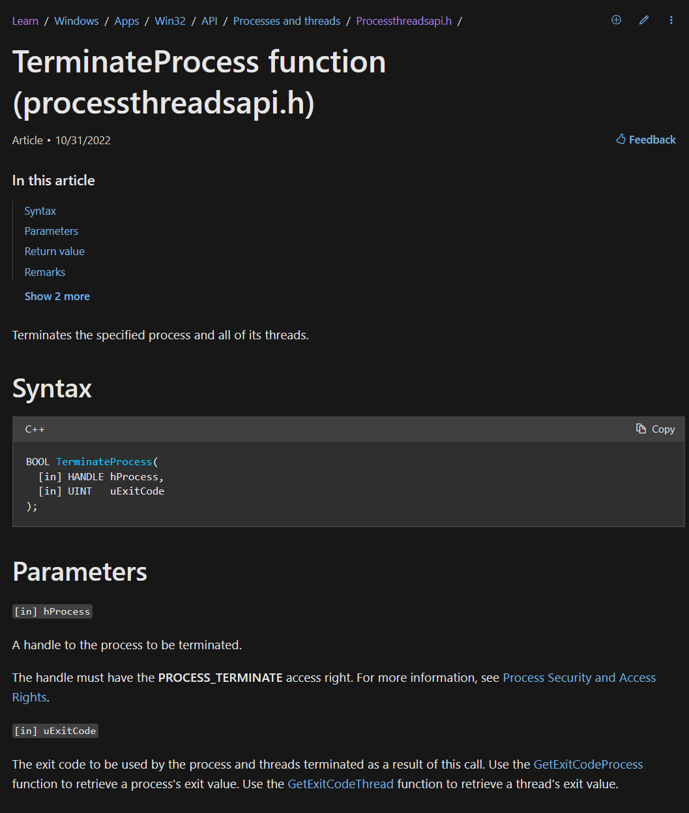

**Windows API Documentation Link**: https://learn.microsoft.com/en-us/windows/win32/api/processthreadsapi/nf-processthreadsapi-terminateprocess
